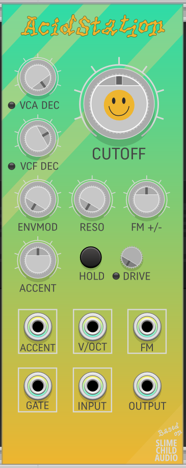
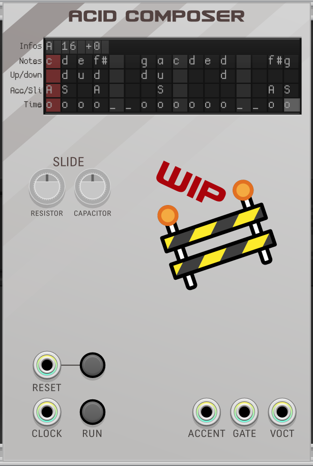

# TAK

## The Acid Kit

__:floppy_disk: Download nightly builds [here](https://github.com/Simon-L/TheAcidKit/releases/tag/Nightly)__

### AcidStation : 303 acid filter
  
Based on Substation Opensource Envelopes and Filter module, many thanks to Slime Child Audio for the input and for sharing their awesome work openly in the first place! :heart:  
Apart from gluing together 2 modules, this module reproduces the behaviour of the internal sequencer in the TB-303 relatively faithfully: VCA and VCF envelopes timing and shape as well as the very specific interplay of envmod with cutoff and accent with resonance (the "quack" or "wow" attack on accented steps).

### AcidComposer : very crudely WIP 303 pattern composer
  
:warning: Heavily WIP!
This is an experiment in entering melodic sequences with the keyboard, almost like a tracker, but most importantly it's inspired by the [TB-303 pattern charts](https://www.peff.com/synthesizers/roland/tb303/Tb303Chart1.pdf). It implements the behaviour revealed by this [research paper](http://sonic-potions.com/Documentation/Analysis_of_the_D650C-133_CPU_timing.pdf) with some additional details explained in KVR threads and direct support from the one and only [antto](http://antonsavov.net/cms/projects).  
Each line contains informations that are then made into a pattern:
- __Infos__: letter identifier, length (BROKEN) and transpose, eg. +2 is 2 semitones up
- __Notes__: note letters from a to g, 2 letters per step, second letter is either # (sharp) or b (flat)
- __Up/Down__: either u/U for one octave up, d/D one octave down or space for normal octave
- __Acc/Sli__: either a/A for accented note, s/S for a slid note
- __Time__: o is play a note, _ is tie, space is no note

There's an overkill bit hidden in this module: slide is made using realtime analog circuit modelling using WDF to get a response very close to the original. The capacitor and resistor knobs affect the slide: increase for longer slides, decrease for shorter slides.

### Disclaimer

> This product includes software developed by Coriander V. Pines, doing business as Slime Child Audio (https://slimechildaudio.com/).

### Acknowledgment
Once again, huge thanks to Slime Child Audio!  
AcidStation would not have been possible without the previous work from antto (on KVR and IRC), aciddose, Robin Schmidt, Robin Whittle, mystran

### References
- http://antonsavov.net/cms/projects/303andmidi.html
- https://www.firstpr.com.au/rwi/dfish/303-unique.html
- https://www.kvraudio.com/forum/viewtopic.php?p=7444400#p7444400
- https://www.cambridge.org/core/journals/organised-sound/article/acid-patterns-how-people-are-sharing-a-visual-notation-system-for-the-roland-tb303-to-create-and-recreate-acid-house-music/1FE37195243684AD6B6912FAE99E99E0
- https://www.peff.com/synthesizers/
